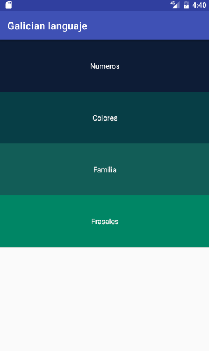

# Multiples pantallas

## Descripcion

App realizada para aprender el trabajo en uno de mis campos favoritos las aplicaciones móviles en Android y la programación de Java.
Esta es una aplicación que desarrollo del aprendizaje en un curso , pero personalizado.

### Personalización

La personalización a la que me refiero es que , lo he puesto para el Gallego - Castellano , para que la gente que no sepa Gallego
sepa un poco más y estar orgullosos de lo que es nuestro.

## Pantallas 





## Notas

Si quieres saber como voy , no dudes en hacer un :

```
git clone https://github.com/jglantonio/multiscreen_app.git multiscreen_app
```

Y cargarla con tu Android Studio :

```
sh ~/android-studio/bin/studio.sh ~/multiscreen_app
```

<hr>
<b>VERÁS EL TRABAJO QUE HAGO !!!</b>
<hr>
